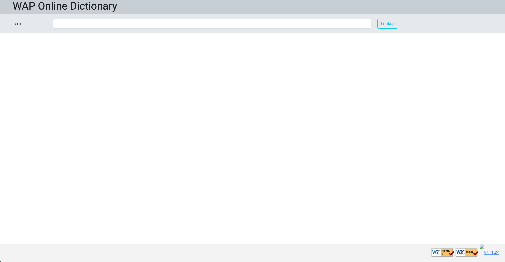
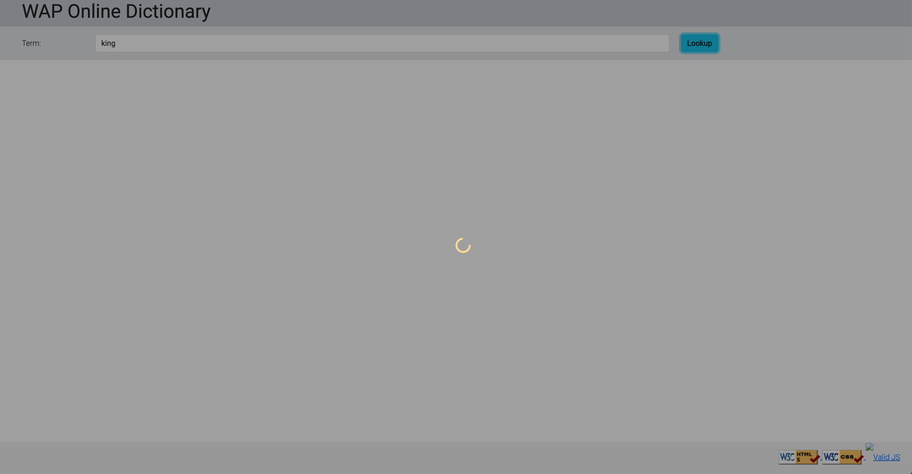
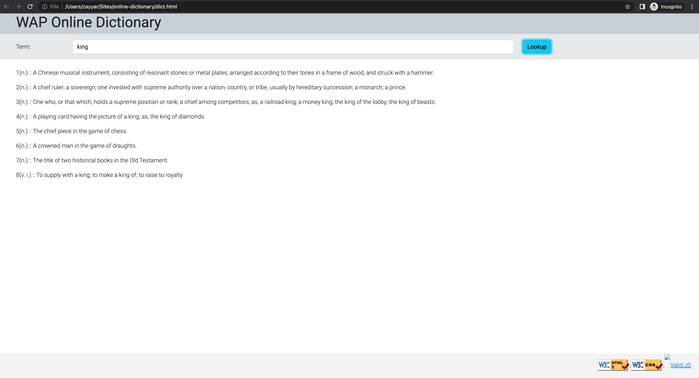

# online-dictionary

An online library system build with HTML, CSS, JavaScript, jQuery, Node.js, AJAX, SQL, and JSON

# 3 different implementations

1. Returns data from query
   - switch to main branch

2. Callback style
   - switch to callback branch

3. Promise style
   - switch to promise branch

# Instructions

- update database configurations inside config file under config folder
- [ npm install && npm run start ] in project directory
- manually open dict.html file and try it out

